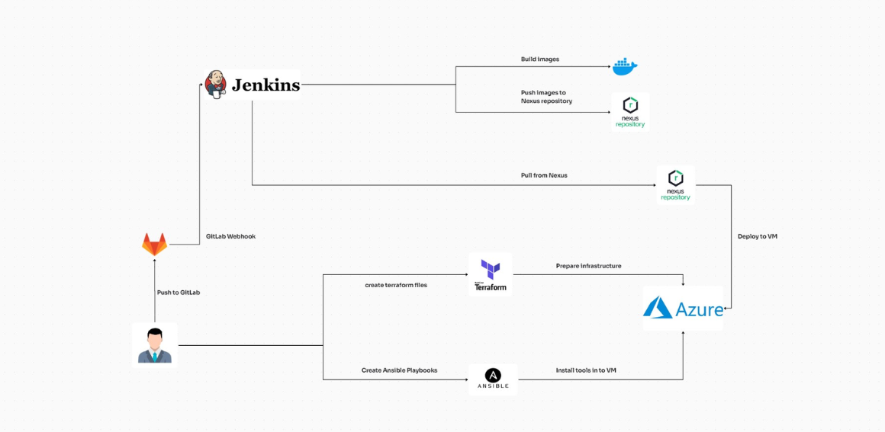

# Summer Internship Project: SECOPS 360

## About the Project
Automation of deployments for an application called **Minitrello**, developed with **NodeJS**, **React**, and **MongoDB**.

## Project Framework
- Dockerization of the Minitrello application with **Docker** and **Docker compose**
- **Automation of deployment with **Jenkins**
- **Management of requests and traffic with **Nginx Proxy Manager**
- **Adoption of Infrastructure as Code (IaC) with **terrafrom**
- **Establishment of an IT automation platform with **Ansible**
- **Deployment of the application on **an Azure virtual machine**
- Use of **Agile Scrum** methodology for project management**
-- Use **Git** and a platform like**GitLab** to manage  source code.

## Project Architecture
 <!-- Replace with the link to your architecture image -->
## CI/CD Pipeline
Our pipeline includes a CI part and a CD part.
 <!-- Replace with the link to your architecture image -->

